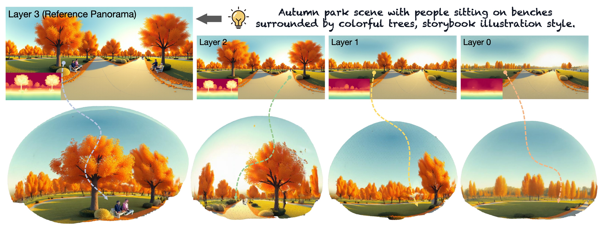
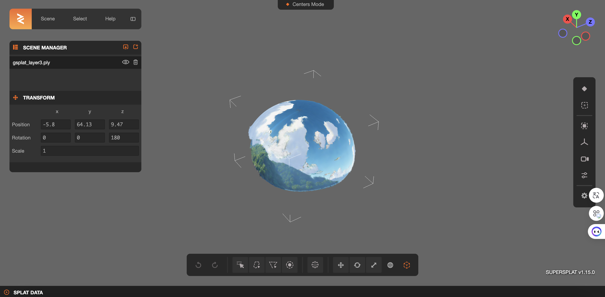

# LayerPano3D: Layered 3D Panorama for Hyper-Immersive Scene Generation


[**Project page**](https://ys-imtech.github.io/projects/LayerPano3D/) | [**Paper**](https://arxiv.org/abs/2408.13252) | [**Video**](https://youtu.be/lpNs5JwaJoA?si=SLNJM7JoBRcsoUg0) | [**Huggingface**](https://huggingface.co/ysmikey/Layerpano3D-FLUX-Panorama-LoRA)



</br>

[Shuai Yang*](https://ys-imtech.github.io/), 
[Jing Tan*](https://sparkstj.github.io/), 
[Mengchen Zhang](https://github.com/kszpxxzmc/), 
[Tong Wu✉️](https://wutong16.github.io/), 
[Yixuan Li](https://yixuanli98.github.io/), 
[Gordon Wetzstein](https://stanford.edu/~gordonwz/), 
[Ziwei Liu](https://liuziwei7.github.io/), 
[Dahua Lin✉️](http://dahua.me/)

<p style="font-size: 0.6em; margin-top: -1em">*Equal Contribution,   ✉️Corresponding author</p>


<p align="center">
<a href="https://arxiv.org/abs/2408.13252">"></a>
<a href="https://ys-imtech.github.io/projects/LayerPano3D/"></a>
<a href="https://www.youtube.com/watch?v=dXvoFRbHOiw"></a>
<a href="" target='_blank'>

</a>
</p>


### 🔧 Installation:
- Prepare Environment
```sh
conda create -n imagine360 python==3.9
conda activate layerpano3d
pip install -r requirements.txt
pip install timm==0.4.12 --no-deps
pip install xformers==0.0.27.post2 --index-url https://download.pytorch.org/whl/cu118
pip install -e submodules/diff-gaussian-rasterization
pip install -e submodules/simple-knn
```

- Install `PyTorch`. We have tested on `torch2.4.0+cu118`, but other versions should also work fine.
```sh
pip install torch==2.4.0 torchvision==0.19.0  --index-url https://download.pytorch.org/whl/cu118
```


- Install `360monodepth`. This might be tricky. Do it step by step. Ask in Issue if you have any problems.
```sh
#Important step here
Modify `submodules/360monodepth/code/cpp/CMakeConfig.txt` Line 65, Change the path of numpy to your own.
```

```sh
sudo apt-get install libgtest-dev libeigen3-dev libboost-all-dev libopencv-dev libatlas-base-dev
sudo apt-get install liblapack-dev libsuitesparse-dev libcxsparse3 libgflags-dev libgoogle-glog-dev libgtest-dev
conda install -c conda-forge libstdcxx-ng=12  

# pybind11
cd submodules/360monodepth/code/cpp/3rd_party
git clone https://github.com/pybind/pybind11.git 
cd pybind11 && mkdir build && cd build
cmake .. && make -j8 
sudo make install
cd ../../ 

# ceres-solver
git clone -b 1.14.0 https://github.com/ceres-solver/ceres-solver
cd ceres-solver && mkdir build && cd build
cmake .. && make -j8 
sudo make install 
cd ../../../  

# instaOmniDepth
mkdir build && cd build
cmake -DCMAKE_BUILD_TYPE=Release  ..
make -j8 
cd ../python
python setup.py build
python setup.py bdist_wheel 
pip install dist/instaOmniDepth-0.1.0-cp39-cp39-linux_x86_64.whl # if failed, please check your file version in dist/
```

- **Checkpoints Download**: 
  - Download the Panorama LoRA [checkpoint](https://huggingface.co/ysmikey/Layerpano3D-FLUX-Panorama-LoRA/resolve/main/lora_hubs/pano_lora_720*1440_v1.safetensors?download=true) and put it in the ``checkpoints`` folder. We will release more powerful and better panorama_lora_v2.safetensors() in the future, now version-1 is avaliable in [huggingface](https://huggingface.co/ysmikey/Layerpano3D-FLUX-Panorama-LoRA).
  - Download the Lama [checkpoint](https://huggingface.co/lllyasviel/Annotators/resolve/main/ControlNetLama.pth?download=true) and put it in the ``checkpoints`` folder.
  - Download the SAM model ViT-H [checkpoints](https://dl.fbaipublicfiles.com/segment_anything/sam_vit_h_4b8939.pth) and put it in the ``checkpoints`` folder.
  - Download the Depth-Anything-V2-Large [checkpoints](https://huggingface.co/depth-anything/Depth-Anything-V2-Large/resolve/main/depth_anything_v2_vitl.pth?download=true) and put it in the ``checkpoints`` folder.
  - Download the Infusion [checkpoint](https://huggingface.co/Johanan0528/Infusion/tree/main) and put it in the ``checkpoints/Infusion`` folder.
  - [**Optional**] Download the PASD related checkpoints. **If you do not need SR panorama for better visual quality, this step can be skip**.
    - Download SD1.5 models from [huggingface](https://huggingface.co/runwayml/stable-diffusion-v1-5) and put them into ``checkpoints/pasd/stable-diffusion-v1-5``. 
    - Download PASD pre-trained models [pasd](https://public-vigen-video.oss-cn-shanghai.aliyuncs.com/robin/models/PASD/pasd.zip) and put them into ``checkpoints/pasd/checkpoint-100000``. 


### 🌌 Inference:

Quick start: one-step running bash. **From a single text prompt to generates full-view, explorable panoramic 3D scene**.
```sh
huggingface-cli login
bash run.sh
```
If you want to try or debug each stage in our pipeline, we also provide a complete [running results](https://drive.google.com/drive/folders/1op5qimyAcr1-k7-8lgOwg-sWa4_qiG1T?usp=drive_link) (including each step).

### 🌆 Rendering:
In the generated 3DGS panoramic scene, the resulting folder contains files formatted as ``gsplat_layer{id}.ply``, where ``id`` represents the index of the layer. The number of layers varies across different cases. Notably, the 3dgs file corresponding to the maximum id value represents the final 3D scene result.

```sh
bash render.sh
```

### 🌉 Visualize `.ply` files


We recommend use [@playcanvas](https://github.com/playcanvas)'s [Super-Splat](https://github.com/playcanvas/super-splat) project ([Live demo](https://playcanvas.com/super-splat)). 



## 📧 Contact Us
Shuai Yang: [yang_shuai@sjtu.edu.cn](mailto:yang_shuai@sjtu.edu.cn)  
Jing Tan: [tj023@ie.cuhk.edu.hk](mailto:tj023@ie.cuhk.edu.hk)  
Tong Wu: [wutong16@stanford.edu](mailto:wutong16@stanford.edu)  

## ✒️ Citation
If you find our work helpful for your research, please consider giving a star ⭐ and citation 📝

```bibtex
@article{yang2024layerpano3d,
  title={LayerPano3D: Layered 3D Panorama for Hyper-Immersive Scene Generation},
  author={Yang, Shuai and Tan, Jing and Zhang, Mengchen and Wu, Tong and Li, Yixuan and Wetzstein, Gordon and Liu, Ziwei and Lin, Dahua},
  journal={arXiv preprint arXiv:2408.13252},
  year={2024}
}
```


